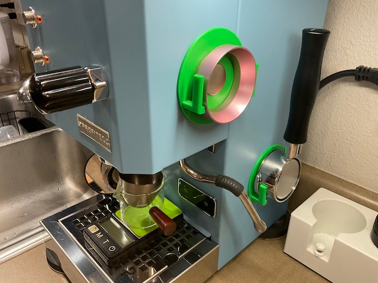
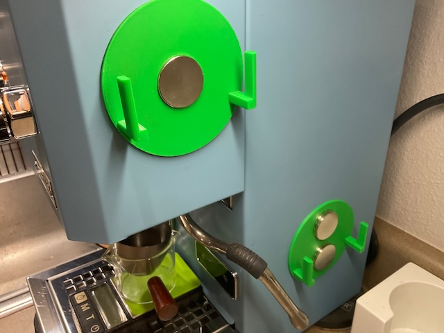
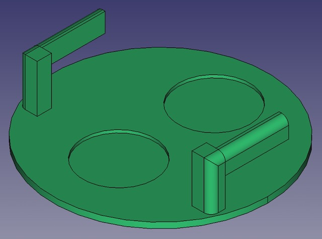
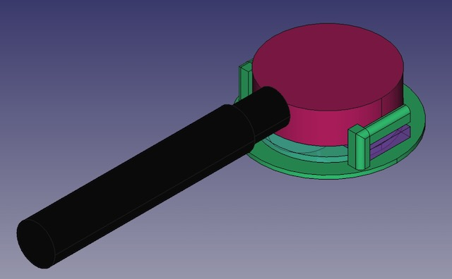

# mag-port
3D printed magnetic portafilter holder. 

Espresso is a demanding hobby in many ways. I wasn't able to find an off-the-shelf portafilter holder with strong enough magnets so I made the mag-port. 

1.18"D x 0.12"H strong neodynium disc magnets 

